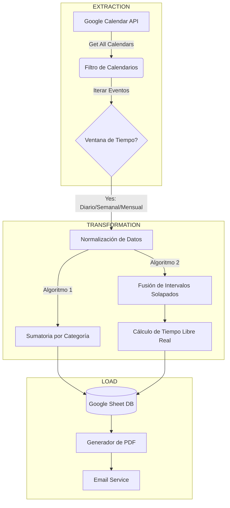

# ⏳ Temporal Mass Balance ETL (Google Apps Script)


> Un motor ETL automatizado que analiza la utilización del tiempo personal extrayendo datos de **Google Calendar**. A diferencia de los análisis estándar, este script calcula tanto la **Carga Multitasking** (suma total de eventos solapados) como el **Tiempo Libre Lineal** real (Gap Analysis) usando algoritmos de fusión de intervalos.

---

## 🧠 Lógica del Sistema: Balance de Masa

El script resuelve un problema clásico de ingeniería de datos aplicado al tiempo: **¿Cómo medir la productividad cuando las tareas se solapan?**

### 1. Carga Multitasking (Multitasking Load)
Suma la duración de *todos* los eventos por categoría, independientemente de si ocurren al mismo tiempo.
* *Ejemplo:* Si estudias (1h) mientras escuchas un podcast técnico (1h) de 10:00 a 11:00, el sistema registra **2 horas de actividad productiva** en un bloque de 1 hora de reloj.

### 2. Tiempo Libre Lineal (Gap Analysis)
Calcula el tiempo real disponible del reloj.
* *Algoritmo:* Extrae todos los intervalos `[Start, End]`, los ordena cronológicamente y fusiona los solapamientos para determinar la "Ocupación Absoluta".
* *Fórmula:* `Potencial (24h) - Ocupación Absoluta = Tiempo Libre Real`.

---

## ⚙️ Configuración e Instalación

### Prerrequisitos
* Cuenta de Google Workspace o Gmail.
* Múltiples calendarios configurados (ej. "Trabajo", "Estudio", "Salud").

### Paso a Paso

1.  **Despliegue:**
    * Crea un nuevo proyecto en [script.google.com](https://script.google.com/).
    * Copia el código de `metrics.gs`.

2.  **Configuración (`CONFIG`):**
    Edita el objeto de configuración al inicio del script para definir tus correos y exclusiones:
    ```javascript
    const CONFIG = {
      EMAIL_PRIMARY: "tu@email.com",
      IGNORED_CALENDARS: ["Festivos", "Cumpleaños"], // Calendarios a omitir
      SHEET_NAME: "Dashboard_Data"
    };
    ```

3.  **Ejecución:**
    * Ejecuta `updateAllMetrics()` para poblar la hoja de cálculo por primera vez.
    * Verifica que se haya creado la hoja `Dashboard_Data` con tres columnas de tiempo: Diario, Semanal y Mensual.

4.  **Automatización:**
    * Configura un trigger (Reloj) para ejecutar `sendWeeklyReport` cada viernes o domingo.

---

## 📊 Output y Reportes

El sistema genera dos artefactos principales:

1.  **Data Warehouse (Google Sheets):**
    Una tabla dinámica que se actualiza automáticamente, mostrando la distribución de horas por categoría en tres ventanas de tiempo (Hoy, Semana, Mes).

2.  **Snapshot PDF:**
    Un reporte estático enviado vía email con el estado de las métricas al momento del cierre de la semana.

---

## 📐 Diagrama de Flujo ETL

El siguiente diagrama ilustra cómo se extraen, transforman (lógica de fusión) y cargan los datos.


## 🛡 Disclaimer

Este proyecto manipula datos personales de calendario. El código se ejecuta **100% del lado del servidor en tu cuenta de Google**. Ningún dato es enviado a terceros externos.

---

Desarrollado por **Javi Giraldo**.
